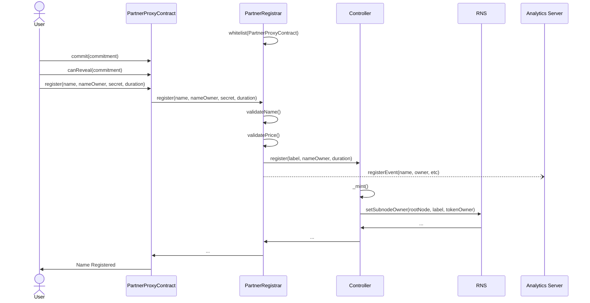

    

<h3 align="middle">RNS Partner Registrar</h3>

    RNS Custom Registrar for IOV Partners

## Overview
> This project encapsulates a set of contracts that extend the RNS protocol, allowing for unique customizations while maintaining backward compatibility to the current implementation of the RNS protocol

## Contracts
The Partner Registrar has five(5) main components
- Registrar
- FeeManager
- PartnerConfiguration
- PartnerManger
- PartnerProxy Factory

### Partner Registrar
- Emit events on registration for easier tracking and analytics
- Update Fee Manager
- Allows registration of new domains from only whitelisted partner using    their custom configuration (i.e domain name length, pricing etc)

### Fee Manager
- Receives all fees from the Registrar
- Provides a method for whitelisted partners to check their balance
- Provides a method for whitelisted partners to withdraw their earnings

### Partner Configuration
- Provides getters and setters used to manage custom configurations for partners

### Partner Manager
- Manages the whitelisting and delisting of partners
- Defines the custom configuration for partner i.e sets and retrives the partner configuration contract

### PartnerProxy Factory
- Spins up new instances of a proxy contract that defines the identity
of a partner in the partner registrar