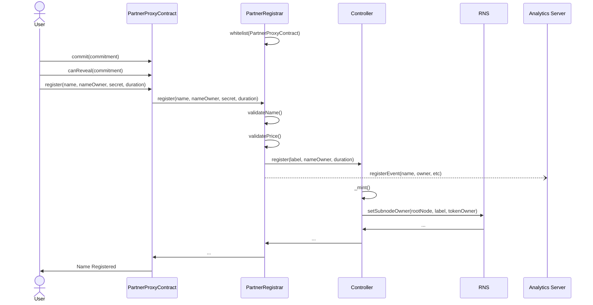

    

<h3 align="middle">RNS Partner Registrar</h3>

    RNS Custom Registrar for IOV Partners

## Overview

## Contracts
The Partner Registrar has five(5) main components
- Registrar
- FeeManager
- PartnerConfiguration
- PartnerManger
- PartnerProxy Factory